  <a href="https://github.com/Baaru">
    <picture>
      <source media="(prefers-color-scheme: dark)" srcset="./assets/hero-dark.svg">
      <source media="(prefers-color-scheme: light)" srcset="./assets/hero-light.svg">
      
    </picture>
  </a>

---

  <h3>⚡ Turning ideas into high-performance digital experiences.</h3>

## 👨‍💻 About Me

I am a passionate **Java Developer** and **Full Stack Engineer** with a strong focus on Cloud Computing and IoT. Currently pursuing my **B.Tech in Information Technology** at Dr. N.G.P Institute of Technology, I thrive on solving complex problems and building robust, scalable software architectures.

- 🔭 I’m currently focused on **Cloud Deployments** and **IoT integrations**.
- ☁️ Previous **AWS Cloud Computing Intern** gaining hands-on experience with EC2, S3, IAM, and VPC.
- 🌱 Continuously exploring new frameworks and architectural patterns.
- 💬 Ask me about **Java, Spring, IoT, or Cloud infrastructures**.

---

## 🛠️ Technical Arsenal

  

---

## 🚀 Featured Projects

  

---

## 📈 GitHub Analytics

  
  

### 🐍 Contribution Graph

  <picture>
    <source media="(prefers-color-scheme: dark)" srcset="https://raw.githubusercontent.com/Baaru/Baaru/output/github-contribution-grid-snake-dark.svg">
    <source media="(prefers-color-scheme: light)" srcset="https://raw.githubusercontent.com/Baaru/Baaru/output/github-contribution-grid-snake.svg">
    
  </picture>

---

## ⏳ Education & Experience

  

---

## 🏆 Certifications & Achievements

  

---

  

